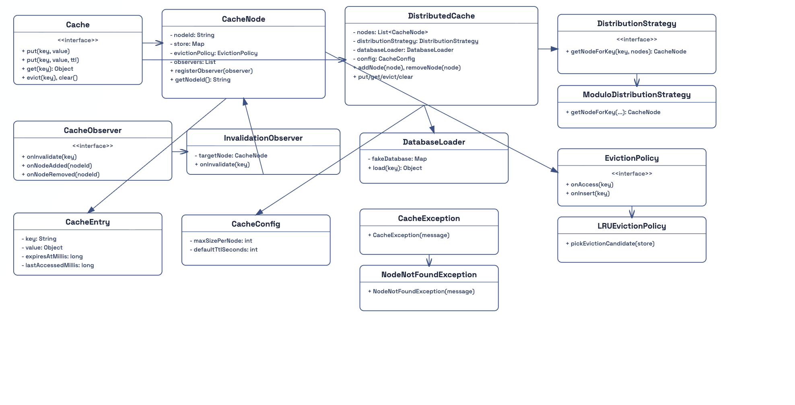
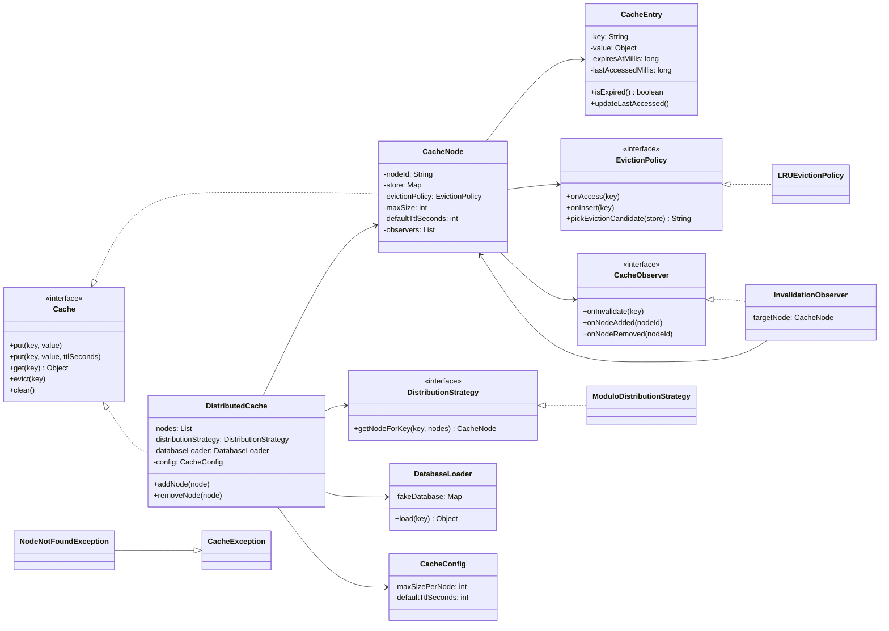

# Design a Distributed Cache

This project implements a distributed cache using Proxy, Strategy, and Observer patterns in Java.

## Features

- Cache access through a proxy-style distributed facade
- Pluggable node distribution strategy
- Pluggable eviction policy (LRU)
- Observer-based invalidation across nodes
- TTL support with lazy expiry
- DB fallback on cache miss

## Package Structure

```text
com.distributedcache
├── Main.java
├── cache
│   ├── Cache.java
│   ├── CacheNode.java
│   └── DistributedCache.java
├── db
│   └── DatabaseLoader.java
├── exception
│   ├── CacheException.java
│   └── NodeNotFoundException.java
├── model
│   ├── CacheConfig.java
│   └── CacheEntry.java
├── observer
│   ├── CacheObserver.java
│   └── InvalidationObserver.java
└── strategy
    ├── DistributionStrategy.java
    ├── ModuloDistributionStrategy.java
    ├── EvictionPolicy.java
    └── LRUEvictionPolicy.java
```

## Class Diagram





## Build and Run

From the Design a Distributed Cache folder:

```bash
javac -d out $(find src -name '*.java')
java -cp out com.distributedcache.Main
```
