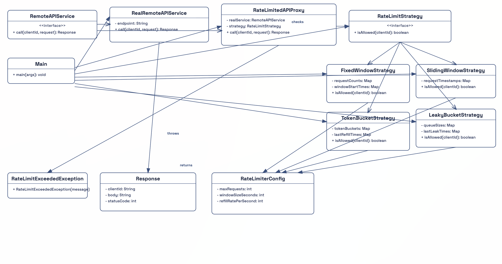
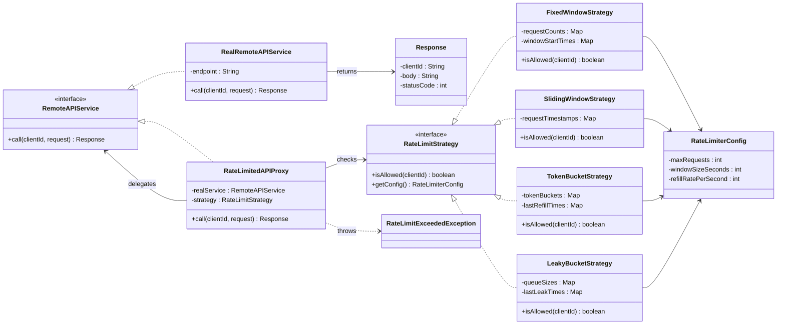

# Design a Rate Limiter

This project implements a rate-limited API access layer using Proxy and Strategy patterns in Java.

## Features

- Proxy-protected API access through `RateLimitedAPIProxy`
- Pluggable strategies:
  - `FixedWindowStrategy`
  - `SlidingWindowStrategy`
  - `TokenBucketStrategy`
  - `LeakyBucketStrategy`
- Per-client tracking
- Custom exception for blocked calls

## Package Structure

```text
com.ratelimiter
├── Main.java
├── api
│   └── RemoteAPIService.java
├── proxy
│   └── RateLimitedAPIProxy.java
├── real
│   └── RealRemoteAPIService.java
├── strategy
│   ├── RateLimitStrategy.java
│   ├── FixedWindowStrategy.java
│   ├── SlidingWindowStrategy.java
│   ├── TokenBucketStrategy.java
│   └── LeakyBucketStrategy.java
├── model
│   ├── RateLimiterConfig.java
│   └── Response.java
└── exception
    └── RateLimitExceededException.java
```

## Class Diagram





## Build and Run

From the `Design a Rate Limiter` folder:

```bash
javac -d out $(find src -name '*.java')
java -cp out com.ratelimiter.Main
```
