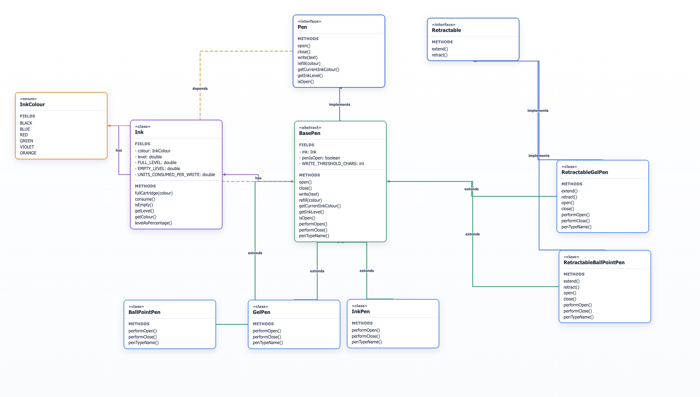

# Pen Design

## Overview

This module contains a complete Java implementation of a pen system with:

- Core abstraction via `Pen` interface
- Shared behavior in `BasePen`
- Non-retractable and retractable concrete pen types
- Ink model with consumable levels and refill support
- Factory-based pen creation through `PenFactory`
- Runtime behavior validation through `Main`

## Package Structure

```text
com.pen
├── Pen.java
├── BasePen.java
├── Retractable.java
├── model
│   └── Ink.java
├── enums
│   ├── InkColour.java
│   └── PenType.java
├── pens
│   ├── BallPointPen.java
│   ├── GelPen.java
│   ├── InkPen.java
│   ├── RetractableBallPointPen.java
│   └── RetractableGelPen.java
├── factory
│   └── PenFactory.java
├── exception
│   ├── PenIsClosedException.java
│   ├── InkFinishedException.java
│   ├── InvalidPenConfigurationException.java
│   └── UnknownPenTypeException.java
└── Main.java
```

## Core Design

- `Pen` defines the contract used by clients.
- `BasePen` implements common open/close/write/refill logic and ink handling.
- `Retractable` adds retractable-specific actions (`extend`, `retract`).
- `BallPointPen`, `GelPen`, and `InkPen` extend `BasePen`.
- `RetractableBallPointPen` and `RetractableGelPen` extend `BasePen` and implement `Retractable`.
- `Ink` tracks colour and level and consumes ink on writes.
- `InkColour` and `PenType` represent domain enums.
- `PenFactory` creates concrete pen instances from `PenType`.

## Build and Run

From the project root:

```bash
cd Design_a_pen/src
javac com/pen/enums/*.java com/pen/model/*.java com/pen/exception/*.java com/pen/*.java com/pen/pens/*.java com/pen/factory/*.java
java com.pen.Main
```

## Class Diagram

Static image:



If `class-diagram.png` is not present yet, add the image file at the project root as `Design_a_pen/class-diagram.png`.
